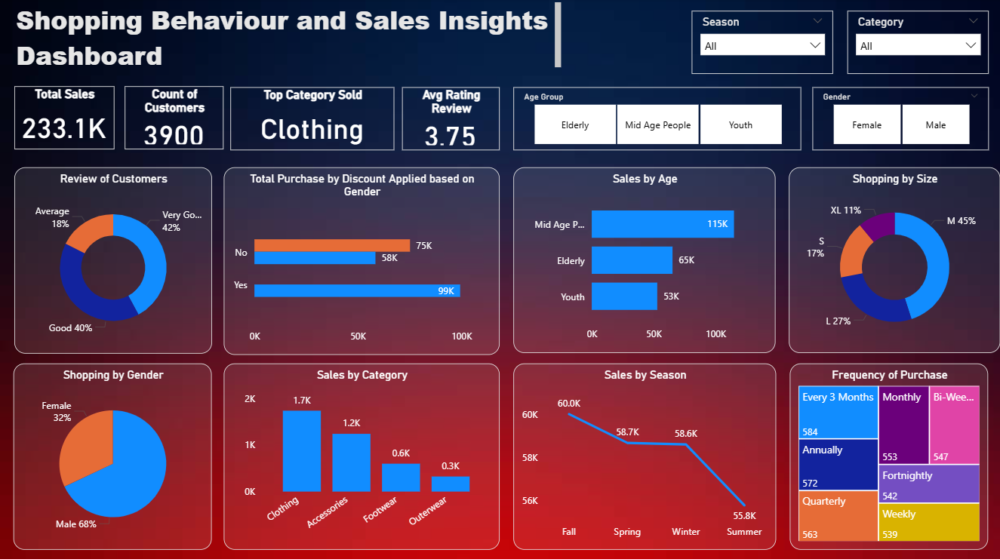

# Shopping Behavior Analysis Dashboard

## Project Overview

This project analyzes customer shopping behavior and sales trends using Power BI. The dashboard provides insights into customer purchasing patterns, product performance, sales distribution, and revenue trends to support data-driven business decisions.

---

## Key Features

- Interactive Power BI dashboard with KPIs and slicers
- Sales and revenue trend analysis
- Customer purchasing behavior analysis
- Product category performance insights
- Region-wise and segment-wise sales visualization

---

## Technologies Used

- Power BI
- Excel
- Data Cleaning
- Data Visualization
- Business Intelligence
- Exploratory Data Analysis (EDA)

---

## Dashboard Preview

---

## Business Insights

- Identified top-performing product categories and customer segments.
- Analyzed sales trends across different regions and time periods.
- Evaluated customer purchasing patterns and order distribution.
- Built interactive reports to support business decision-making.

---

## Files Included

- Shopping_Behavior_Analysis.pbix
- Dashboard Screenshot

---

## Author

**Sreeja Mullasseri**
